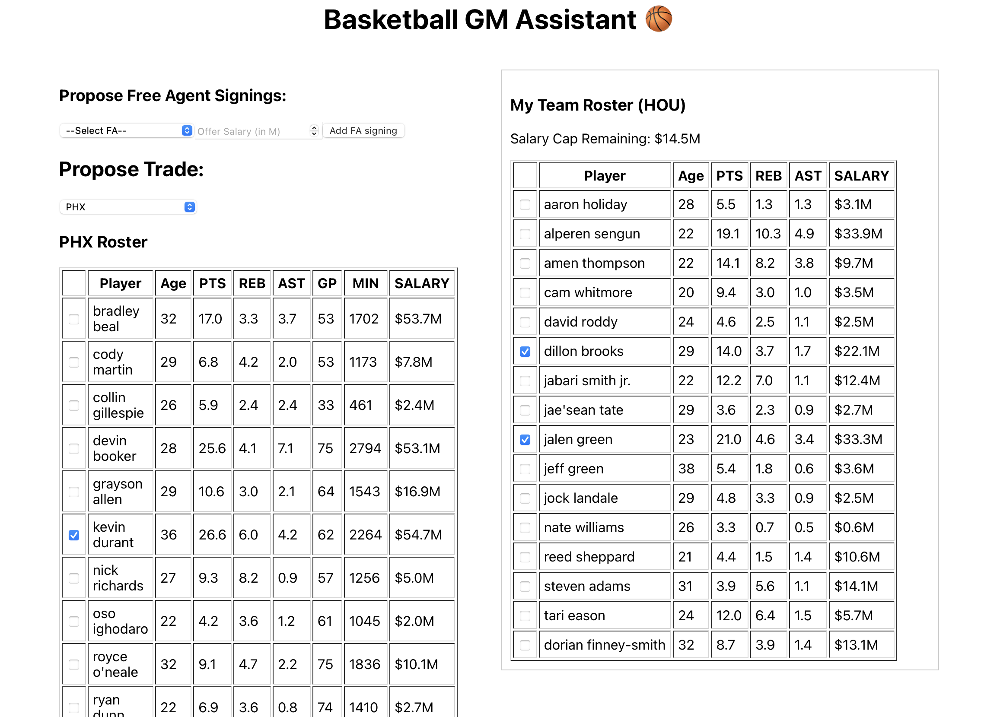
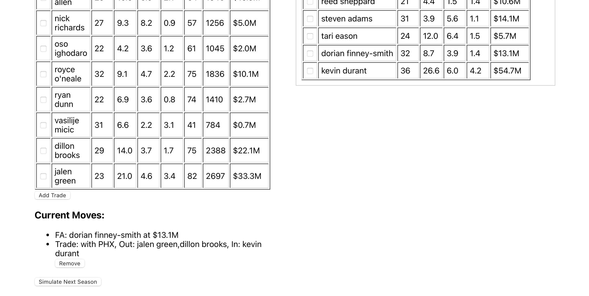

# Basketball GM Simulation

**Basketball GM Simulation** is an interactive **basketball general manager simulation web application** that allows users to:

- Select a team
- Propose realistic free agent signings and trades
- Simulate the next season’s performance using custom-trained machine learning models.

Try it here : https://basketball-gm-simulation.vercel.app

This project integrates a modern **React frontend**, a robust **FastAPI + Python backend**, and a suite of **PyTorch and scikit-learn models** for player aging and team win prediction, delivering an immersive simulation experience for basketball fans and aspiring GMs.

---

## Key Features

### Team management interface:

- **Team selection** from a curated list of 30 basketball teams.
- Interactive UI for:
  - **Proposing free agent signings**, with precise salary input (decimal precision supported).
  - **Multi-player trades**, featuring selectable rosters for both user team and trade partners.

### League rule enforcement:

- Realistic **salary cap and trade mechanics**:
  - 200% outgoing salary allowance if below the cap.
  - 125% outgoing salary allowance if above the cap.
- Bird rights implemented for re-signing current players.
- Restrictions on signing free agents from other teams to ensure realism.

### Machine learning-powered season simulation:

- Automatic identification of top 9 players by predicted minutes for season simulation.
- Predicts season outcomes based on player aging, development, and historical performance trends.

---

## Predictive Modeling Details

### Win prediction model:

- **Model type**: Custom **PyTorch Multi-Layer Perceptron (MLP) regressor**.
- **Input features**: 126 stats derived from top 9 players (PTS, REB, AST, OREB, STL, BLK, TOV, FG_PCT, FG3M, FG3_PCT, FT_PCT, MIN, AGE, GP, PLUS_MINUS).
- **Training data**: 5 seasons of historical NBA team records.
- **Training config**:
    - Batch size: 8
    - Epochs: 200
    - Optimizer: Adam with weight decay regularization
    - Loss function: MSELoss
- **Performance**:
  - MAE: \~3.17 wins
  - R² score: 0.89.

Note : It is found out that the model relies heavily on PLUS_MINUS stat, so a separate simulation model without PLUS_MINUS stat is used for more randomness and entertainment of the users.

### Player aging models:

- **Model type**: Independent **scikit-learn RandomForestRegressor models**.
- **Stats modeled**: Core stats (e.g., PTS\_per\_min, REB\_per\_min, FG\_PCT, PLUS\_MINUS, etc.)
- Example R² scores:
  - PTS\_per\_min: 0.78
  - REB\_per\_min: 0.89
  - AST\_per\_min: 0.84

Models capture nonlinear relationships between age and year-over-year stat changes, including regression toward the mean, aging decline, and improvements for young players.

Note: For some stats that showed weak R² scores(e.g., FG_PCT, MIN, GP), fallback heuristics are applied
---

## Architecture Overview

### Frontend:

- Built with **React + Hooks API**.
- API communication via **axios**.
- Step-by-step user workflow for a polished UX.

### Backend:

- Built with **FastAPI**.
- API endpoints for:
  - `/teams`, `/fa_list`, `/roster/{team}`
  - `/sign_fa`, `/trade`, `/simulate`
- Implements salary cap, trade rules, and aging simulation.

### Machine Learning integration:

- ML pipeline:
  - Player aging prediction
  - Win prediction using updated stats

---

## Project Structure

```
basketball-gm-simulation/
├── backend/
│   └── app/
│       ├── main.py
│       ├── routes.py
├── frontend/
│   ├── src/
│   │   ├── components/
│   │   ├── api.js
│   │   └── App.js
├── models/ # Save Pytorch / Regressor models
│   ├── aging/
│   ├── win_predictor_mlp_simulation.pkl # without +/-
├── data/ # NBA API data
│   ├── player_stats_2024-25_cleaned.csv
│   ├── player_stats_2024-25_with_salaries.csv
│   ├── fa_player.csv
│   └── ...
├── src/  # Python files 
│   ├── simulate_team_with_offseason_moves.py
│   ├── predict_player_next_season_stats.py
│   ├── pytorch_model.py
│   ├── load and clean data...
├── requirements.txt
└── README.md
```

---

## Setup Instructions

### Load and clean data

```bash
python3 -m venv venv
source venv/bin/activate
pip install -r requirements.txt
python3 src/data_loader.py
python3 src/clean_team_estimates.py
python3 src/clean_player_stats.py
python3 src/build_team_features.py
python3 src/build_team_player_features.py
python3 src/scrape_salaries.py
python3 src/add_salary_col.py
```

### Build Model

```bash
python3 src/build_training_data.py
python3 src/model.py
python3 src/pytorch_model.py
python3 src/build_player_aging_dataset.py
python3 src/train_player_aging_models.py
python3 src/predict_player_next_season_stats.py
python3 src/simulate_team_with_offseason_moves.py
```

### Backend:

```bash
uvicorn backend.app.main:app --reload --port 8001
```

### Frontend:

```bash
cd frontend/
npm install
npm start
```

- Frontend: `http://localhost:3000`
- Backend: `http://localhost:8001`

---

## Example User Flow

1. User selects “Houston Rockets”

2. UI displays current roster + salary cap remaining

3. User browses free agents
 
4. proposes offer (e.g. Dorian Finney-Smith at $13.1M)

5. User proposes trade with another team (choose from player selector and team selector)

6. Confirm (add) trade

7. System validates moves (league trade and salary cap rules) and warns if unrealistic

8. User confirms — system simulates next season:


---

## Notes

- **Disclaimer**: Independent project for educational use. No official affiliation with NBA/NBPA.
- Player/team names used for simulation only.

---

# requirements.txt (recommended dependencies)

```
fastapi
uvicorn
pydantic
pandas
scikit-learn
torch
joblib
```